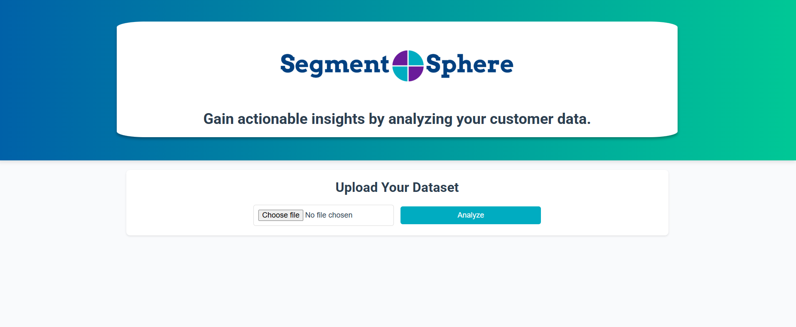
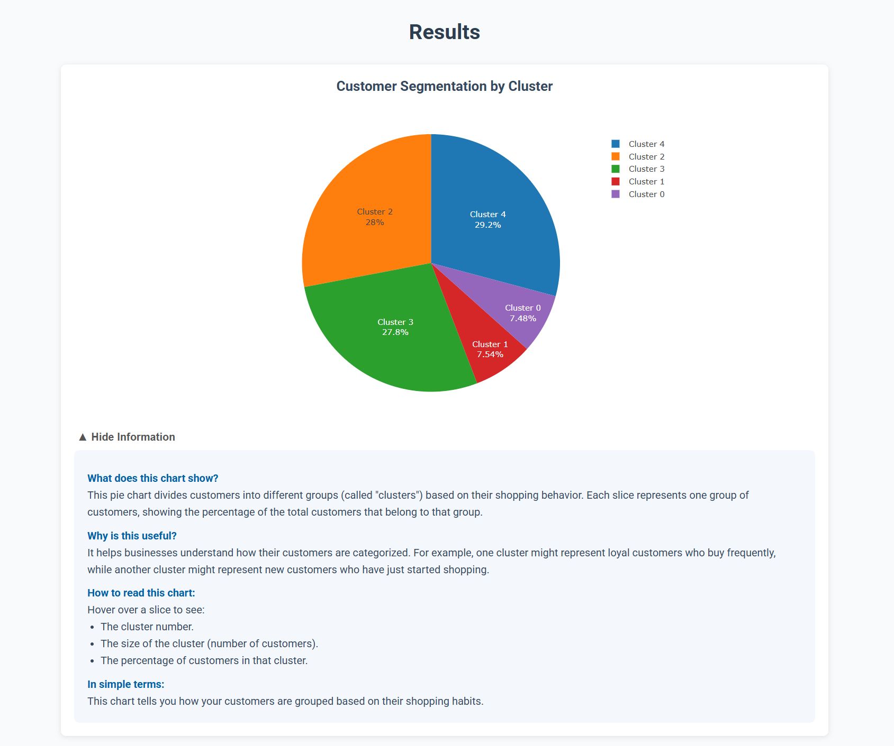
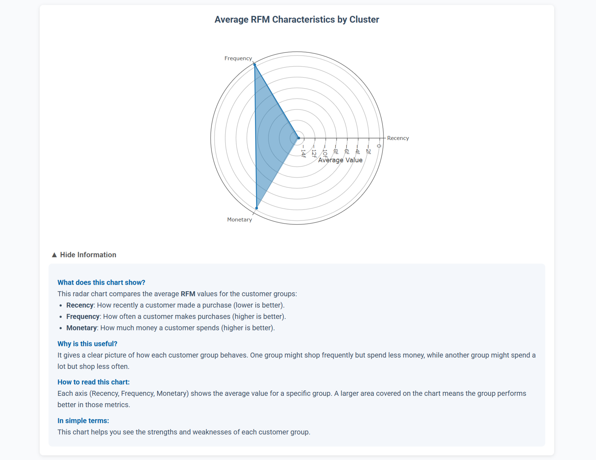
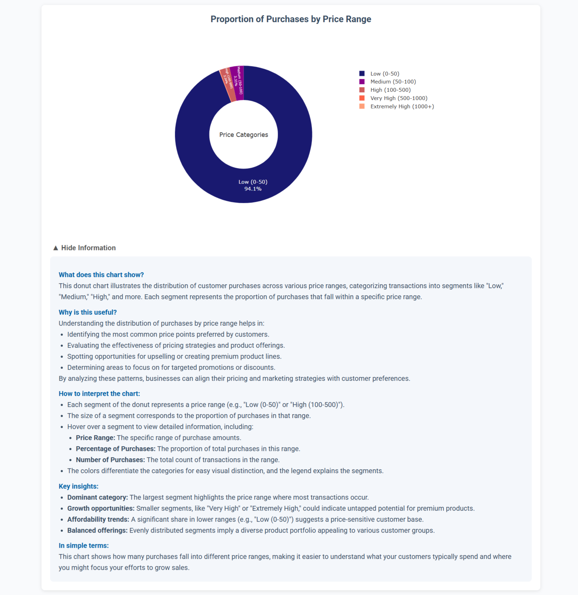
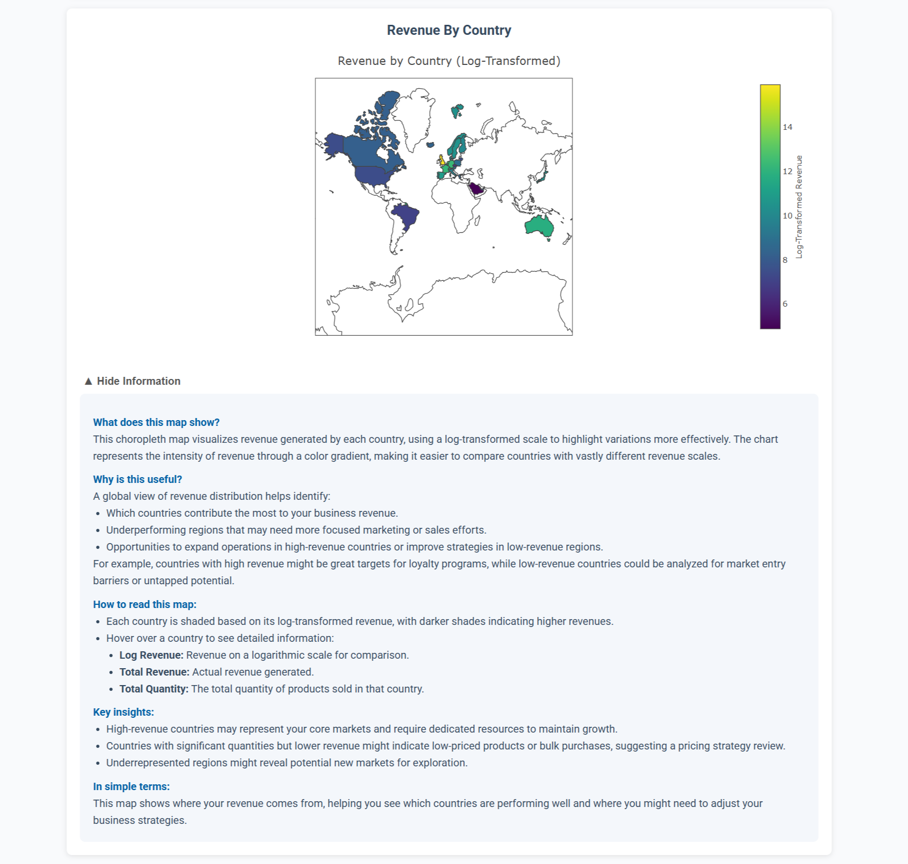

# <h1 align="center">Segment Sphere: RFM Customer Segmentation</h1>

**An interactive customer segmentation platform using RFM analysis to provide actionable insights on customer behavior.**

 

---

## Project Description

**Segment Sphere** is a tool designed to analyze customer data and provide actionable insights through **RFM analysis (Recency, Frequency, and Monetary)**. It enables businesses to segment their customers into meaningful groups, helping them better understand customer behavior and improve decision-making.

---

## Table of Contents
- [Project Title and Overview](#project-title-and-overview)
- [Project Description](#project-description)
- [Features](#features)
- [Technology Stack](#technology-stack)
- [Preview](#preview)
- [Installation](#installation)
- [Usage](#usage)
- [Configuration](#configuration)
- [Testing](#testing)
- [License](#license)
- [FAQs](#faqs)
- [Contact Information](#contact-information)

---

## Features

- Automated RFM analysis for customer segmentation.
- Interactive visualizations using Plotly for actionable insights.
- User-friendly web interface for data upload and visualization.
- Scalable architecture supporting large datasets.

---

## Technology Stack

**Frontend**:
- HTML5, CSS3, JavaScript (ES6)
- Bootstrap for responsive design

**Backend**:
- Python, Flask (for RESTful API)
- Pandas, NumPy (for data preprocessing)
- Scikit-learn (for K-means clustering)


**Other Tools**:
- Plotly (for chart visualizations)

---

## Preview

Below are previews showcasing a selection of insightful visualizations generated by Segment Sphere. Explore the platform to dive deeper into more detailed charts and comprehensive RFM analysis insights!







---

## Installation

To set up the project locally, follow these steps:

1. Clone the repository:
    ```bash
    git clone https://github.com/ThakkarVidhi/rfm-customer-segmentation.git
    cd rfm-customer-segmentation
    ```

2. Install the necessary dependencies:
    ```bash
    pip install -r requirements.txt
    ```

3. Set up the database and run the app:
    ```bash
    python main.py
    ```

4. Open `http://127.0.0.1:5000/` in your browser to start using the application.

---

## Usage

To run the RFM analysis, follow these steps:

1. Upload your CSV file containing customer data (with columns: InvoiceNo, StockCode, Description, Quantity, InvoiceDate, UnitPrice, CustomerID, Country).
2. Select the appropriate file and click "Analyze".
3. View the segmentation results and explore the interactive charts.

---

## Configuration

This project uses a `config.py` file for managing application settings and paths. The configuration file contains the following settings:

### Configuration Settings:

- `BASE_DIR`: The absolute path to the base directory of the project.
- `STATIC_DIR`: Path to the static directory used to serve static files (e.g., CSS, JavaScript, images).
- `INPUT_DATA_DIR`: Path to the directory where input data (e.g., CSV files) is stored.
- `TEMPLATE_DIR`: Path to the directory containing HTML templates for the application.
- `MODEL_PATH`: Path to the saved machine learning model used for customer segmentation.
- `DEBUG`: Set to `True` for enabling debugging during development.


---

## Testing

This project does not include automated tests. To test the application, simply open it in your browser and interact with the site.

---

## License

This project is licensed under the [MIT License](LICENSE).  


---

## FAQs

**Q: What data format is required for upload?**  
**A:** CSV files with columns for `InvoiceNo`, `StockCode`, `Description`, `Quantity`, `InvoiceDate`, `UnitPrice`, `CustomerID`, and `Country`.

**Q: How can I modify the application’s configuration?**  
**A:** The configuration can be modified by editing the `config.py` file. You can change the paths and other settings like `DEBUG`.

**Q: What should I do if the application is not displaying correctly?**  
**A:** Make sure the required directories and files are in place. Check the browser's developer tools for errors, and verify that the paths in `config.py` are correct.

**Q: Can I use a different machine learning model for segmentation?**  
**A:** Yes, you can replace the model file (`customer_segmentation_model.pkl`) in the `app/models` directory with another compatible model as long as it follows the same format.

---

## Contact Information

For questions or feedback, you can reach me at [vidhithakkar.ca@gmail.com](mailto:vidhithakkar.ca@gmail.com) or via [LinkedIn](https://www.linkedin.com/in/vidhi-thakkar-0b509724a/).